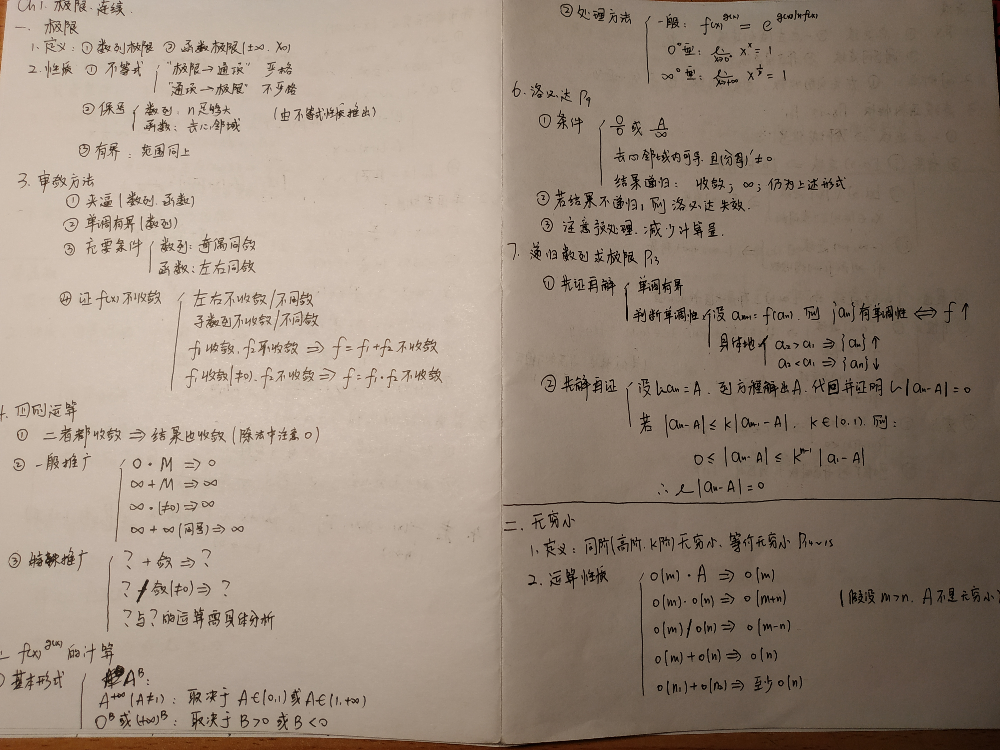
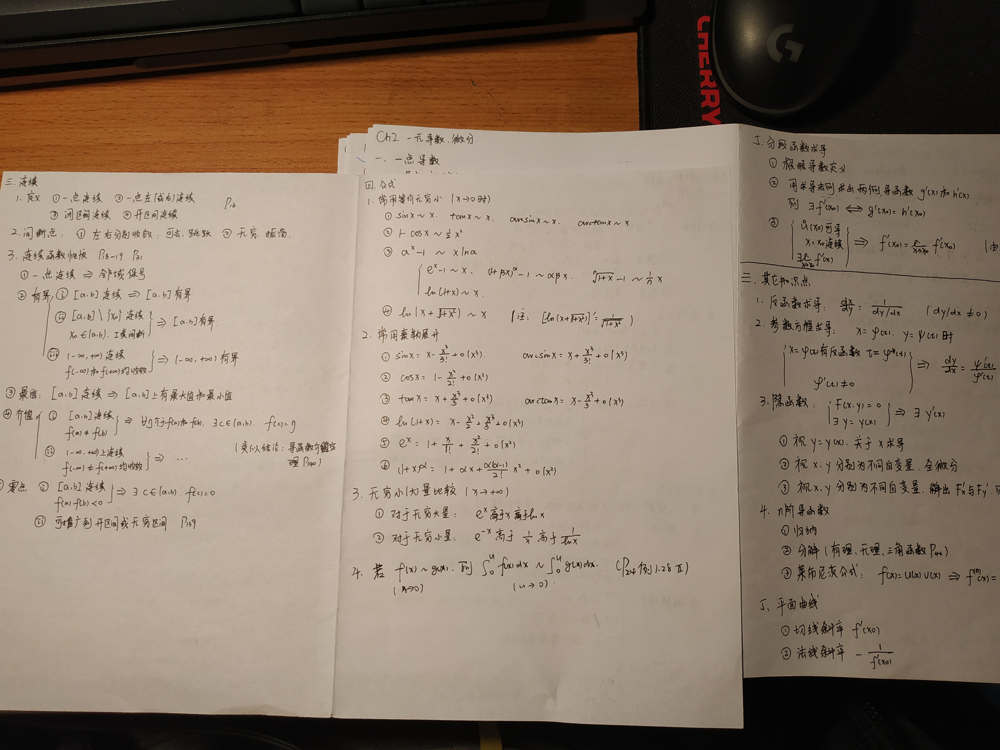

# 考研经验贴
大家好，我是19年信科智能方向上岸的。在这里大概讲讲我的经验。

先说一下基本情况：
- 西安交大应届科班
- 初试403（数学144，英语82，专业课121，政治56）
- 机试五道

## 初试
### 数学
我初试数学144，是个还不错的分数。今年算是被数学抬了一手，否则恐怕没学上。

#### 一轮复习：高数
我从四月份开始复习，一开始看的是张宇十八讲。快刷完这本书的时候，听说李范全书不错，就换了。
事实证明，李范全书的高数部分确实很好。我前后把李范全书的高数刷了四遍，以下重点讲这段经历：

第一遍：

我把李范全书的高数部分完整的刷了一遍。在刷第一遍的过程中，标出错题/不会的题。
如果看了答案以后，发现某个知识点或者技巧自己掌握得不牢，一定要在题目旁边做相应的标注。

我第一遍刷李范全书真的非常艰难，错题大概占到了所有题目的一半，一度怀疑自己的智商。
（即使你被李范全书打击了自信，也不要轻言放弃。或许以后也能140+呢。）

第二遍：

我在第二遍的时候，整理了比较完整的笔记，形式如下。对于内容较少的章节，一张 A4 纸就够了；内容较多的章节可能需要两张甚至更多。
（注意：照片中的笔记实际上是我后来再次整理的。第一遍记笔记不必这么整齐，有少量疏漏也是可以接受的。）

这一遍只需要做第一遍标出的题目，并把依然做错/不会做的题目再次重点勾画，并在一张纸（比如李范全书的最后一页空白处）记录题号。

第三遍：

重新做第二遍中标出的题目，并仔细地过一遍书上的知识点。
这一遍的主要目的是补充笔记中的疏漏。

第四遍：

重新做标出的题目。

做四遍李范全书真的很花时间，而且也不是必要的。希望大家根据自己的情况作出调整。

#### 一轮复习：线代
李范全书上的线代部分我没看过，不太清楚讲得怎么样。我用的是李永乐的线代讲义，刷了两遍。

和李范全书的高数部分类似，第一遍完整刷，第二遍整理笔记且只做错题。

#### 一轮复习：概率论
我刷了两遍李范全书的概率论，最后几章比较简略，我用了张宇的概率论八讲补充。具体刷法同上。

（与高数和线代不同，我没有发现概率论有非常值得推荐的考研资料，可能我见得比较少吧。）

#### 二轮复习
复习完第一轮，时间大概到了九月份。我在二轮复习中只做了660（因为时间真的很紧张）。
这本书只需要刷一遍，但一定要注意刷这本书的目的：查漏补缺。
在刷的过程中，要结合题目继续补充笔记。刷完后，把自己之前做的笔记重新整理一遍。
在重新整理笔记的过程中，对于已经掌握透彻的知识点可以简写（但不要遗漏）。

#### 三轮复习
经历前两轮复习后，时间已经所剩不多了。我在第三轮复习中刷了两遍李永乐的红皮真题。

第一遍按年份刷，每张卷子严格计时，模拟考场上的状态。最好准备一张 A4 纸，记录每张卷子上没有完美答对的题目编号，并简略地注明原因。
第二遍按章节刷，体会高频考点和出题套路。

（留下最近两三年的卷子，在考前最后半个月仿真）

#### 最后冲刺
当时已经到十二月了，我没有做模拟题，只把自己之前整理的三科笔记拿出来看看，再刷刷真题中的错题。然后用17和18年卷子做了仿真。

### 英语
英语82分，还算比较高。
先自吹自擂一下，我英语基础还不错：大一的第一学期过四级，第二学期过六级；从大二开始看了很多纯英文的专业资料。总之阅读能力还是很强的。

我从四月开始复习，先刷了一个多月的扇贝，熟悉考研英语中的常见词汇，之后刷了两遍真题（留下17和18年没有做）
第一遍刷真题，只做阅读。阅读在考研英语中分值很大；完型、新题型、翻译也直接受到阅读水平的影响。
第二遍刷真题，基本只做了阅读和新题型，挑了几张卷子做了完型和翻译。

刷完两遍真题后，时间还剩一些，我用张剑的阅读练习，刷了二十篇左右。
在考前一周，用17年和18年试了下手感，除了作文以外所有题目都做了。

关于作文的事情我要提一下，我在还剩四十多天的时候背了几篇王江涛的范文，但实在感觉费时间，就放弃了。

在考场上，我花了一个多小时做完了前面的所有题型，又花了一个多小时现场编了作文，最后还剩二十分钟左右，检查了一下卷子。
这里有个考场上的小技巧：拿到卷子后，先看作文题目，再做前面的题目；在做的过程中，画出可能有用的词组搭配。我就是这样裸考作文19分的。

### 专业课
作为科班出身，复习大半年却只考了121，实在算不上复习得很好。说实话，我不太好意思说太多“经验”。
建议大家去看 [深森的经验贴](http://www.cskaoyan.com/thread-654145-1-1.html)。

#### 数据结构
只刷张铭的教材和习题集即可，看到排序和B树就差不多了，后面更难的知识点不太可能考（最起码以近几年的情况看如此）。

张铭的教材上，代码风格不太好，例如并查集的代码实际上非常精简，在书上却写了一页多的代码。
建议大家遇到看不懂的代码时，在网上找找其他代码，看懂后再去看张铭的教材。

另外，网上可以找到北大历年的数据结构期中和期末考题，有兴趣的同学可以刷一刷。

（至于王道，可刷可不刷，看个人选择）

#### 计组
陆老师的mooc讲得很好，考试也基本上是mooc中的知识点。建议大家把课件打印出来，多看几遍，做好笔记。

北大的推荐教材是一本黑书。时间充裕的同学可以看看第二章和第四章，分别讲得是mips指令和cpu。
我当时把黑书上的第二章和第四章习题分别刷了一大半，但实际上考试不会考那么难的题。

（至于王道，不建议看）

#### 操作系统和网络
这两门课的mooc都很重要，同时考试范围和王道的覆盖内容比较相近。建议mooc、王道两开花。

### 政治
我政治56分，勉强过线。我说一下自己的复习经历，大家当教训看就好。

我从六月开始看徐涛的强化班视频，断断续续地到十月份才看了一半。
之后觉得政治药丸，裸刷肖老一千题。刷了一半以后，肖八出来了，认真地刷了几遍肖八。再之后就是背肖四大题了。

总之，我的政治开始地很早，却几乎没有有效地复习过，最后成绩还不如很多裸考党。希望大家引以为戒。

## 复试
我在初试结束后，也是浪了很久，再加上家里出了一些事，导致复试复习得也很一般。

我刷算法题挺久的，先后刷过 leetcode、斯坦福cs97si、刘汝佳紫书+蓝书、挑战程序设计竞赛（都是挑着刷的，没有一个刷完）。
个人感觉，leetcode 适合在刚入门的时候锻炼基本的编程基本功，之后用挑战程序设计竞赛即可。这本书的难度循序渐进，很适合我这种算法苦手。

（一个小插曲：今年机试有一道题，是我去年做过的原题，是 [cs97si的一道练习题](http://web.stanford.edu/class/cs97si/assn7.html)）

关于面试，我其实刷了很长时间的 cs231n，学了一些 CNN 和 RNN 的东西。没想到老师在面试中完全没有问，而是问了很多本科的学习情况。
（可能是我太菜了吧...）

## 闲言碎语
评价学习效果的，不应该是外在指标（例如“今天刷了多少题/在图书馆待了几个小时”），而应该是“是否以高度集中的精神状态，学习自己尚未掌握的知识”。

我尤其不建议大家晒进度，或者看到别人的进度而焦虑。如果进度能说明一切，那我十二月才刷完数学真题、一份模拟题都没刷，为什么数学144呢？
